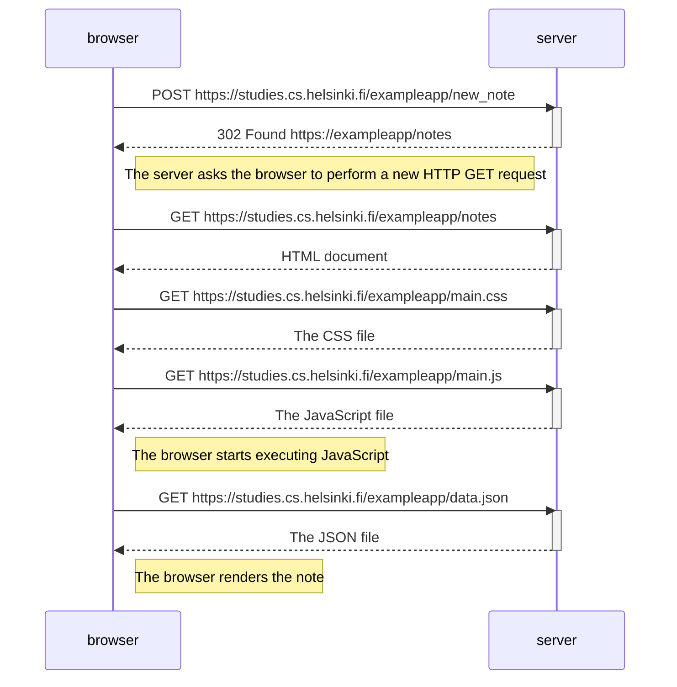

```mermaid
sequenceDiagram 
participant browser 
participant server

browser->>server: POST https://studies.cs.helsinki.fi/exampleapp/new_note
activate server
server-->>browser: 302 Found https://exampleapp/notes
deactivate server
note right of browser: The server asks the browser to perform a new HTTP GET request
browser->>server: GET https://studies.cs.helsinki.fi/exampleapp/notes
activate server
server-->>browser: HTML document
deactivate server

browser->>server: GET https://studies.cs.helsinki.fi/exampleapp/main.css
activate server
server-->>browser: The CSS file
deactivate server

browser->>server: GET https://studies.cs.helsinki.fi/exampleapp/main.js
activate server
server-->>browser: The JavaScript file
deactivate server

note right of browser: The browser starts executing JavaScript

browser->>server: GET https://studies.cs.helsinki.fi/exampleapp/data.json
activate server
server-->>browser: The JSON file
deactivate server

note right of browser: The browser renders the note
```