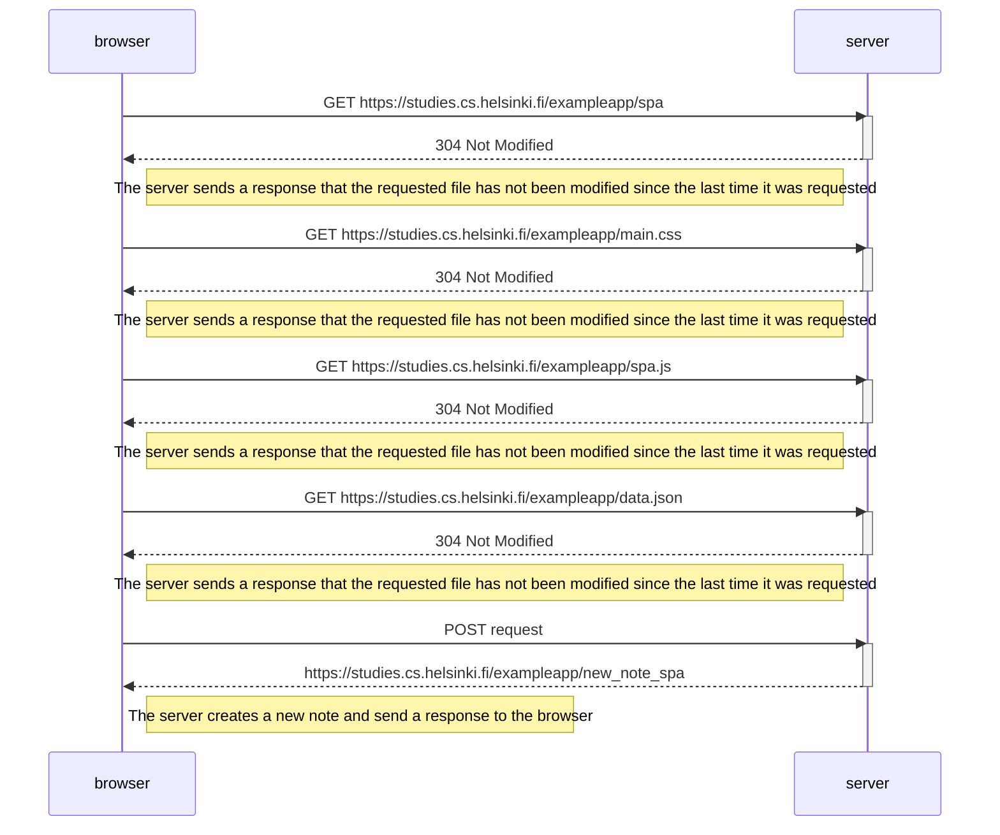

```mermaid

sequenceDiagram 
participant browser 
participant server

browser->>server: GET https://studies.cs.helsinki.fi/exampleapp/spa
activate server
server-->>browser: 304 Not Modified
deactivate server
note right of browser: The server sends a response that the requested file has not been modified since the last time it was requested

browser->>server: GET https://studies.cs.helsinki.fi/exampleapp/main.css
activate server 
server-->>browser: 304 Not Modified
deactivate server
note right of browser: The server sends a response that the requested file has not been modified since the last time it was requested


browser->>server: GET https://studies.cs.helsinki.fi/exampleapp/spa.js
activate server
server-->>browser: 304 Not Modified
deactivate server
note right of browser: The server sends a response that the requested file has not been modified since the last time it was requested

browser->>server: GET https://studies.cs.helsinki.fi/exampleapp/data.json
activate server
server-->>browser: 304 Not Modified
deactivate server

note right of browser: The server sends a response that the requested file has not been modified since the last time it was requested

browser->>server: POST request
activate server
server-->>browser: https://studies.cs.helsinki.fi/exampleapp/new_note_spa
deactivate server

note right of browser: The server creates a new note and send a response to the browser

```